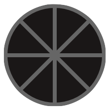

# Pie Draw

  

Create intricate geometric designs with this symmetrical sketch pad.

## Features

### Undo

  

Erase last drawn line

### Trash

  

Erase all. Can't be undone. No warning given.

### Save

  

Download as a PNG (doesn't work on mobile as far as I know).  Tool bars/btns are removed in download.

### Color Palette

  

Randomly generated on page load; refresh page to generate new palette.

### Slice Selector

  

How many sections of symmetry should there be? Click to cycle between the options (8 through 1).
